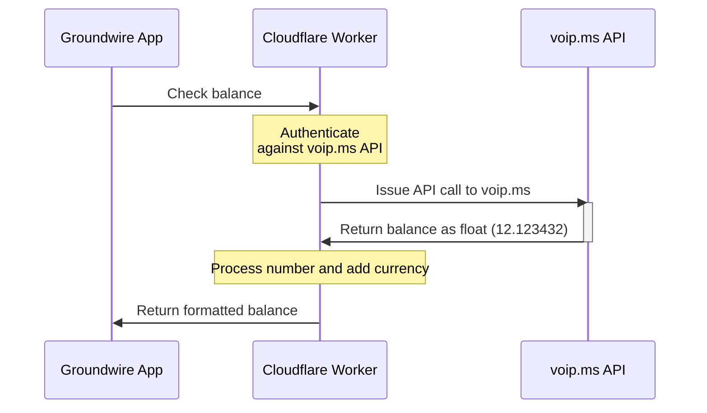

# Balance checker for voip.ms at Acrobits Groundwire iOS app

Cloudflare Worker to expose [voip.ms](voip.ms) API in [Groundwire format](https://doc.acrobits.net/api/client/balance_checker.html). Build it as a side project to practice knowledge in Github, Node, Express, etc. If you see any opportunity for optimization - pull requests are welcome.

# Deployment

## voip.ms

1. Go to [voip.ms API page](https://voip.ms/m/api.php) and configure API password.
2. Enable API by clicking `Enable/Disable API`. Make sure that it shows `Enabled`
3. Set the API password
4. Set `Enable IP Addresses` to `0.0.0.0` **Note that it presents security risk**.

P.S. After lengthy conversation with voip.ms support team, I could not find the way to permit Cloudflare ranges access only.

## Cloudflare

Set the password from Step 3 as a secret via `wrangler secret put VOIP_PASSWORD`
(You have to have `wrangler` installed. You still will need it installed to deploy the CF Worker)

Set token for authentication with the Cloudflare for extra protection (required) as `wrangler secret put TOKEN`

In the end you should have `CURRENCY`, `VOIP_USERNAME`, `VOIP_PASSWORD` and `TOKEN` variables in your Cloudflare Worker.

## Groundwire iOS App

Configure in Groundwire settings

`Settings -> Select voip.ms number -> Advanced Settings -> Web Services -> Balance Checker`

# Groundwire screenshot

